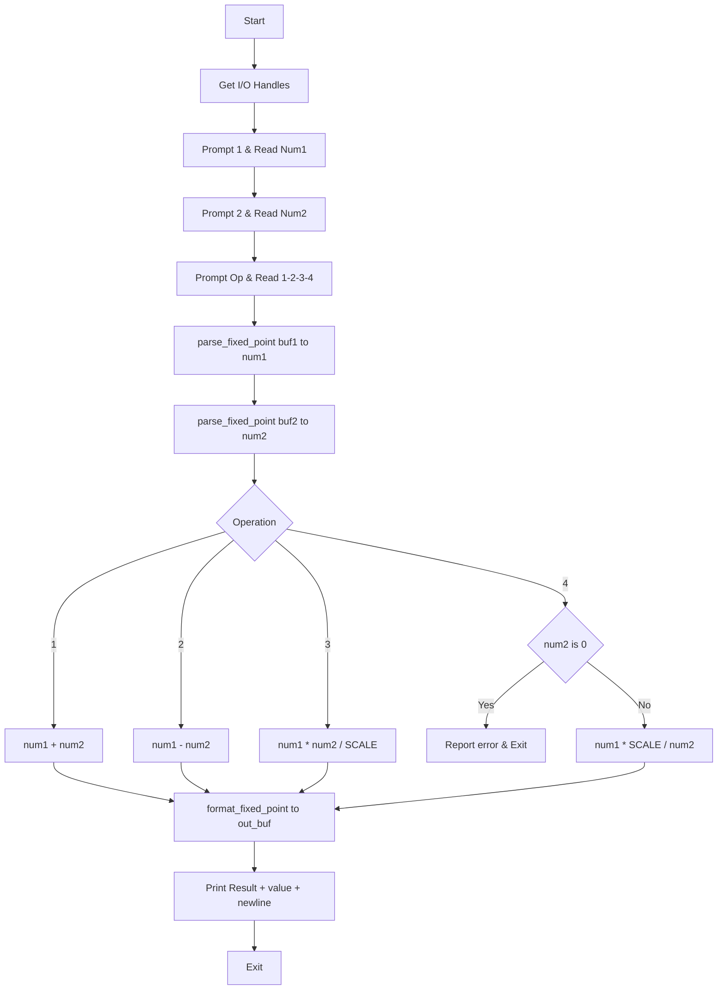
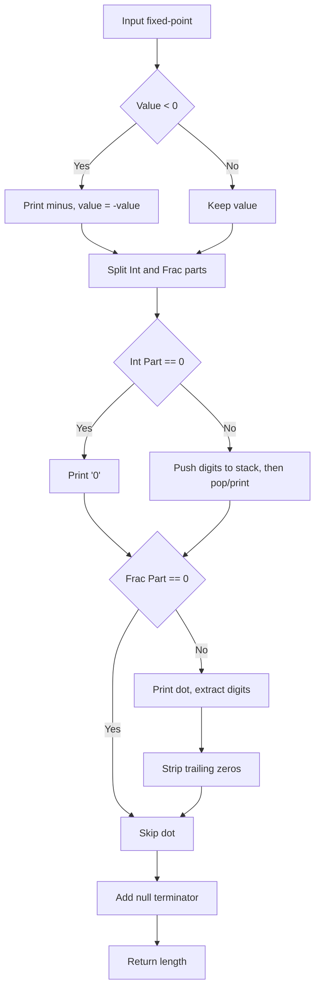

# NASM Arithmetic Calculator

**English** | [中文](./README.zh-CN.md)

A fixed-point calculator implemented in pure assembly, supporting addition, subtraction, multiplication, and division. No floating-point instructions, no C library, and no Windows API—interacts directly with the kernel using system calls.

## Features

| Feature            | Description                                                  |
| :----------------- | :----------------------------------------------------------- |
| **Basic Arithmetic**| Addition (1), Subtraction (2), Multiplication (3), Division (4) |
| **Mixed Input**     | Supports two integers, two decimals, or one of each          |
| **Negative Numbers**| Supports inputs like `-3`, `-2.5`, `-.5`                     |
| **Fixed-Point**     | 6 digits of precision (64/32-bit), 3 digits (DOS)            |
| **Output Optimization**| Integers show no decimals; decimals strip trailing zeros     |
| **Zero-Check**      | Errors out on division by zero (exit code 1)                 |

## Prerequisites

**Windows:**

| Tool         | Purpose    | Installation                                      |
| :----------- | :--------- | :------------------------------------------------ |
| **NASM**     | Assembler  | https://www.nasm.us/ or `winget install nasm`     |
| **MinGW-w64**| Linker     | https://www.mingw-w64.org/ or `winget install mingw-w64` |

**Linux:**

| Tool       | Purpose    | Installation                                                 |
| :--------- | :--------- | :----------------------------------------------------------- |
| **NASM**   | Assembler  | `sudo apt install nasm` (Debian/Ubuntu) or `sudo dnf install nasm` (Fedora) |
| **ld/gcc** | Linker     | Usually pre-installed with binutils; 32-bit requires `gcc -m32` or `ld -m elf_i386` |
| **DOSBox** | 16-bit Run | Optional, for running `calc_dos.com`: `sudo apt install dosbox` |

## Build

**Windows:** Execute in project directory:
```batch
build.bat
```

**Linux:** Execute in project directory:
```bash
chmod +x build.sh
./build.sh
```

Upon success, the following will be generated:
- **Windows**: `calc.exe`, `calc_32.exe`, `calc_dos.com`
- **Linux**: `calc_linux` (64-bit), `calc_linux_32` (32-bit), `calc_dos.com` (16-bit, requires DOSBox)

## Usage

### 1. Launch Program

**64-bit Windows:**
```batch
calc.exe
```

**32-bit Windows:**
```batch
calc_32.exe
```

**Linux (64-bit):**
```bash
./calc_linux
```

**Linux (32-bit):**
```bash
./calc_linux_32
```

**DOS Environment (DOSBox / FreeDOS):**
```batch
calc_dos.com
```

### 2. Input Flow

Follow the prompts and press Enter:

| Step | Prompt                                                  | Input Description                     |
| :--- | :------------------------------------------------------ | :------------------------------------ |
| 1    | `Enter first number (int or decimal, negative ok):`     | First operand (integer, decimal, negative) |
| 2    | `Enter second number (int or decimal, negative ok):`    | Second operand                        |
| 3    | `Operation (1=add 2=sub 3=mul 4=div):`                  | Type: `1` Add, `2` Sub, `3` Mul, `4` Div |

### 3. Operation Types

| Input | Math | Example    |
| :---- | :--- | :--------- |
| `1`   | Add  | 3 + 5 = 8  |
| `2`   | Sub  | 6 - 2 = 4  |
| `3`   | Mul  | 2 × 0.5 = 1|
| `4`   | Div  | 6 ÷ 2 = 3  |

Any other character defaults to addition.

### 4. Input Examples

- Integers: `3`, `-10`, `0`
- Decimals: `3.14`, `0.5`, `-.25`
- Mixed: 1st number `2`, 2nd number `0.5`, etc.

### 5. Sample Execution

```
Enter first number (int or decimal, negative ok): 3
Enter second number (int or decimal, negative ok): 5
Operation (1=add 2=sub 3=mul 4=div): 1
Result: 8

Enter first number (int or decimal, negative ok): 6
Enter second number (int or decimal, negative ok): 2
Operation (1=add 2=sub 3=mul 4=div): 4
Result: 3

Enter first number (int or decimal, negative ok): 2
Enter second number (int or decimal, negative ok): 0.5
Operation (1=add 2=sub 3=mul 4=div): 3
Result: 1

Enter first number (int or decimal, negative ok): -3
Enter second number (int or decimal, negative ok): 1.5
Operation (1=add 2=sub 3=mul 4=div): 1
Result: -1.5
```

### 6. Error Handling

- **Division by Zero**: If operation `4` is selected and the 2nd number is `0`, the program outputs `Error: division by zero` and exits with code 1.

## Project Structure

```
ASM-CLI-Calculator/
├── calc.asm         # 64-bit Windows (syscall)
├── calc_32.asm      # 32-bit Windows (int 0x2e)
├── calc_dos.asm     # 16-bit DOS (int 21h)
├── calc_linux.asm   # 64-bit Linux (syscall)
├── calc_linux_32.asm# 32-bit Linux (int 0x80)
├── build.bat        # Windows build script
├── build.sh         # Linux build script (64/32/16-bit)
└── README.md        # Documentation (English)
```

## Flowcharts

Logic is consistent across platforms; below is the general workflow.

### Main Logic



### Parsing (parse_fixed_point)

```mermaid
graph TD
    A[Input string pointer] --> B[Skip whitespace]
    B --> C{First Char}
    C -->|Minus| D[Sign = -1, Skip]
    C -->|Plus| E[Sign = 1, Skip]
    C -->|Other| F[Sign = 1]
    D --> G[Integer part: result = 0]
    E --> G
    F --> G
    G --> H{Current Char}
    H -->|Digit| I[result = result*10 + digit]
    I --> H
    H -->|Dot| J[Fraction part: frac = 0]
    H -->|Non-digit| K[result = int*SCALE]
    J --> L{Current Char}
    L -->|Digit| M[frac = frac*10 + digit, count++]
    M --> L
    L -->|Other| N[Pad frac to 6 digits (3 for DOS)]
    N --> O[result = int*SCALE + frac]
    O --> P[result *= sign]
    K --> P
    P --> R[Return fixed-point]
```

### Formatting (format_fixed_point)



### Platform I/O Differences

| Platform | Get Handle | Output | Input | Exit |
|------|----------|------|------|------|
| Windows 64 | PEB→ProcessParameters | syscall NtWriteFile | syscall NtReadFile | syscall NtTerminateProcess |
| Windows 32 | fs:[0x30]→PEB | int 0x2e NtWriteFile | int 0x2e NtReadFile | int 0x2e NtTerminateProcess |
| Linux 64 | stdin=0, stdout=1 | syscall write(1,...) | syscall read(0,...) | syscall exit(60) |
| Linux 32 | Fixed 0/1 | int 0x80 write(4) | int 0x80 read(3) | int 0x80 exit(1) |
| DOS 16 | N/A | int 21h AH=09 | int 21h AH=0Ah | int 21h AH=4Ch |

## Technical Notes

- **Fixed-Point**: Value = Internal Integer / SCALE (SCALE=1,000,000 for 64/32-bit, 1,000 for DOS).
- **Implementation**: Pure assembly using integer arithmetic only.
- **Windows 64-bit**: `syscall` (NtReadFile/NtWriteFile).
- **Windows 32-bit**: `int 0x2e` interrupt.
- **Linux 64-bit**: `syscall` (read=0, write=1, exit=60).
- **Linux 32-bit**: `int 0x80` (read=3, write=4, exit=1).
- **16-bit DOS**: `int 21h` (AH=09 output, AH=0Ah input, AH=4Ch exit).

## FAQ

**Q: Build fails with 'nasm not found'?**  
A: Install NASM and add it to your PATH, or use the full path to the executable.

**Q: 32-bit linking failed?**  
A: Ensure you have MinGW-w64 with `-m32` support or the relevant 32-bit toolchain installed.

**Q: How to run the DOS version?**  
A: Use DOSBox, FreeDOS, or a VM to load and run `calc_dos.com`.

**Q: 'ld' linking failed on Linux?**  
A: Try `gcc -nostdlib -e _start calc_linux.o -o calc_linux` as an alternative to `ld`.

**Q: Linux 32-bit build failed?**  
A: Install 32-bit libs (e.g., `sudo apt install gcc-multilib` on Ubuntu) or use `ld -m elf_i386`.
