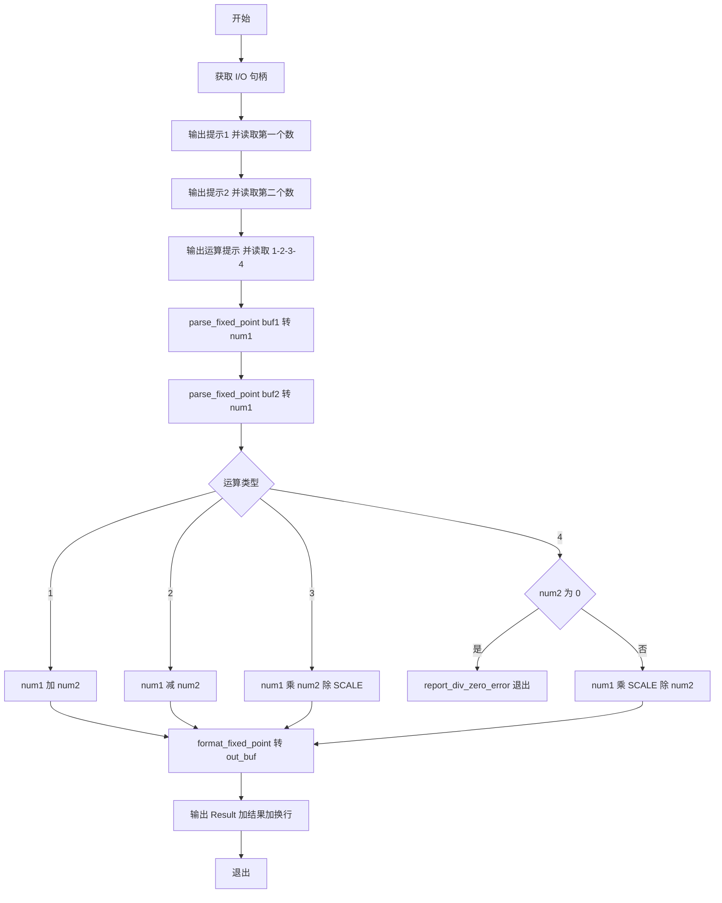
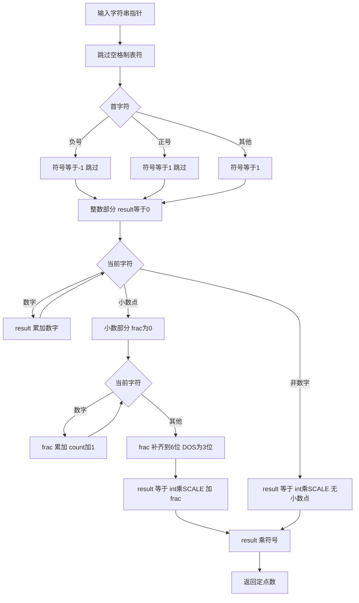
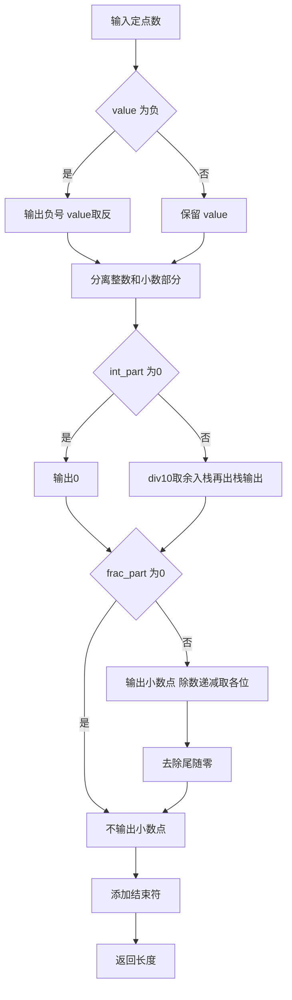

# NASM 四则运算计算器

[English](./README.md) | **中文**

纯汇编实现的定点数计算器，支持加减乘除。无浮点指令、无 C 库、无 Windows API，使用系统调用直接与内核交互。

## 功能特性

| 功能       | 说明                                             |
| :--------- | :----------------------------------------------- |
| **四则运算** | 加(1)、减(2)、乘(3)、除(4)                       |
| **混合输入** | 两个整数、两个浮点数、或一整数一浮点数           |
| **负数支持** | 如 `-3`、`-2.5`、`-.5`                           |
| **定点数**   | 64/32 位 6 位小数，DOS 版 3 位小数               |
| **输出优化** | 整数不显示小数，浮点数去除尾随零                 |
| **除零检查** | 除数为 0 时输出错误并退出（退出码 1）            |

## 环境要求

**Windows：**

| 工具         | 用途     | 安装                                              |
| :----------- | :------- | :------------------------------------------------ |
| **NASM**     | 汇编器   | https://www.nasm.us/ 或 `winget install nasm`     |
| **MinGW-w64**| 链接器   | https://www.mingw-w64.org/ 或 `winget install mingw-w64` |

**Linux：**

| 工具       | 用途     | 安装                                                         |
| :--------- | :------- | :----------------------------------------------------------- |
| **NASM**   | 汇编器   | `sudo apt install nasm`（Debian/Ubuntu）或 `sudo dnf install nasm`（Fedora）|
| **ld/gcc** | 链接器   | 通常随 binutils 预装；32 位需 `gcc -m32` 或 `ld -m elf_i386`  |
| **DOSBox** | 16 位运行| 可选，用于运行 `calc_dos.com`：`sudo apt install dosbox`     |

## 构建

**Windows：** 在项目目录下执行：
```batch
build.bat
```

**Linux：** 在项目目录下执行：
```bash
chmod +x build.sh
./build.sh
```

成功后将生成：
- **Windows**：`calc.exe`、`calc_32.exe`、`calc_dos.com`
- **Linux**：`calc_linux`（64 位）、`calc_linux_32`（32 位）、`calc_dos.com`（16 位，需 DOSBox 运行）

## 使用说明

### 1. 启动程序

**64 位 Windows：**
```batch
calc.exe
```

**32 位 Windows：**
```batch
calc_32.exe
```

**Linux（64 位）：**
```bash
./calc_linux
```

**Linux（32 位）：**
```bash
./calc_linux_32
```

**Linux（16 位，需 DOSBox）：**
```bash
dosbox calc_dos.com
```

**DOS 环境（DOSBox / FreeDOS）：**
```batch
calc_dos.com
```

### 2. 输入流程

程序会依次提示输入，按回车确认：

| 步骤 | 提示                                                    | 输入说明                     |
| :--- | :------------------------------------------------------ | :--------------------------- |
| 1    | `Enter first number (int or decimal, negative ok):`     | 第一个数，支持整数、小数、负数 |
| 2    | `Enter second number (int or decimal, negative ok):`    | 第二个数                     |
| 3    | `Operation (1=add 2=sub 3=mul 4=div):`                  | 运算类型：`1` 加 `2` 减 `3` 乘 `4` 除 |

### 3. 运算类型

| 输入   | 运算 | 示例       |
| :----- | :--- | :--------- |
| `1`    | 加法 | 3 + 5 = 8  |
| `2`    | 减法 | 6 - 2 = 4  |
| `3`    | 乘法 | 2 × 0.5 = 1|
| `4`    | 除法 | 6 ÷ 2 = 3  |

输入其他字符时默认执行加法。

### 4. 输入格式示例

- 整数：`3`、`-10`、`0`
- 小数：`3.14`、`0.5`、`-.25`
- 混合：第一个数 `2`，第二个数 `0.5` 等

### 5. 完整运行示例

```
Enter first number (int or decimal, negative ok): 3
Enter second number (int or decimal, negative ok): 5
Operation (1=add 2=sub 3=mul 4=div): 1
Result: 8

Enter first number (int or decimal, negative ok): 6
Enter second number (int or decimal, negative ok): 2
Operation (1=add 2=sub 3=mul 4=div): 4
Result: 3

Enter first number (int or decimal, negative ok): 2
Enter second number (int or decimal, negative ok): 0.5
Operation (1=add 2=sub 3=mul 4=div): 3
Result: 1

Enter first number (int or decimal, negative ok): -3
Enter second number (int or decimal, negative ok): 1.5
Operation (1=add 2=sub 3=mul 4=div): 1
Result: -1.5
```

### 6. 错误处理

- **除零**：选择除法(4)且第二个数为 0 时，输出 `Error: division by zero` 并以退出码 1 退出。

## 项目结构

```
ASM-demo/
├── calc.asm         # 64 位 Windows（syscall）
├── calc_32.asm      # 32 位 Windows（int 0x2e）
├── calc_dos.asm     # 16 位 DOS（int 21h）
├── calc_linux.asm   # 64 位 Linux（syscall）
├── calc_linux_32.asm# 32 位 Linux（int 0x80）
├── build.bat        # Windows 构建脚本
├── build.sh         # Linux 构建脚本（64/32/16 位）
└── README.md        # 说明文档
```

## 程序流程图

各平台程序（calc.exe / calc_linux / calc_dos.com）逻辑一致，以下为通用流程图。

### 主程序流程



### 字符串解析流程（parse_fixed_point）



### 定点数格式化流程（format_fixed_point）



### 各平台 I/O 差异

| 平台 | 获取句柄 | 输出 | 输入 | 退出 |
|------|----------|------|------|------|
| Windows 64 | PEB→ProcessParameters | syscall NtWriteFile | syscall NtReadFile | syscall NtTerminateProcess |
| Windows 32 | fs:[0x30]→PEB | int 0x2e NtWriteFile | int 0x2e NtReadFile | int 0x2e NtTerminateProcess |
| Linux 64 | stdin=0, stdout=1 固定 | syscall write(1,...) | syscall read(0,...) | syscall exit(60) |
| Linux 32 | 同上 | int 0x80 write(4) | int 0x80 read(3) | int 0x80 exit(1) |
| DOS 16 | 无需 | int 21h AH=09 | int 21h AH=0Ah | int 21h AH=4Ch |

## 技术说明

- **定点数**：值 = 存储整数 / SCALE（64/32 位 SCALE=1000000，DOS SCALE=1000）
- **解析/格式化**：全汇编实现，仅用整数运算
- **Windows 64 位**：`syscall` 指令（NtReadFile/NtWriteFile）
- **Windows 32 位**：`int 0x2e` 软中断
- **Linux 64 位**：`syscall`（read=0, write=1, exit=60）
- **Linux 32 位**：`int 0x80`（read=3, write=4, exit=1）
- **16 位 DOS**：`int 21h`（AH=09 输出，AH=0Ah 输入，AH=4Ch 退出）

## 常见问题

**Q: 构建失败提示找不到 nasm？**  
A: 安装 NASM 并确保已加入 PATH，或使用完整路径调用。

**Q: 32 位链接失败？**  
A: 需安装支持 `-m32` 的 MinGW-w64，或单独安装 32 位工具链。

**Q: DOS 版如何运行？**  
A: 使用 DOSBox、FreeDOS 或虚拟机加载 `calc_dos.com` 运行。

**Q: Linux 下 ld 链接失败？**  
A: 可尝试 `gcc -nostdlib -e _start calc_linux.o -o calc_linux` 替代 ld。

**Q: Linux 32 位构建失败？**  
A: 需安装 32 位工具链：Ubuntu 下 `sudo apt install gcc-multilib`，或使用 `ld -m elf_i386`。
